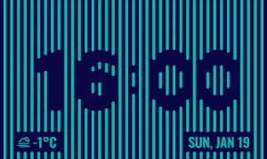

# BarBar Clock | [Web demo](https://barbar-clock.web.app/)

Clock face for the [Flutter Clock Challenge](https://flutter.dev/clock).

This clock face shows time using negative space. Top and bottom bars move when time changes. In addition, clock face displays weather conditions, temperature and current date:

Licenses:
* Clock face: [BSD3](LICENSE)
* Oswald font: [OFL](digital_clock/fonts/oswald/OFL.txt)
* weather-icons-lite font: [OFL](digital_clock/fonts/weather-icons-lite/LICENCE.md)

